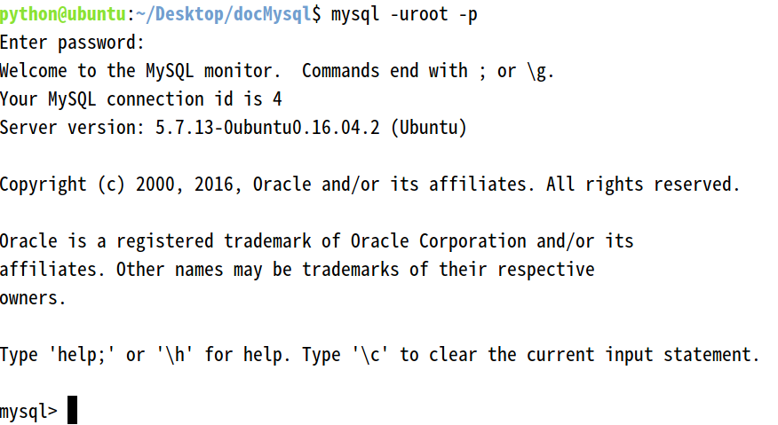
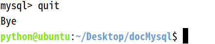

---
title:MySql数据库与表操作
---

## MySql数据库与表操作

## 数据库简介

- 人类在进化的过程中，创造了数字、文字、符号等来进行数据的记录，但是承受着认知能力和创造能力的提升，数据量越来越大，对于数据的记录和准确查找，成为了一个重大难题
- 计算机诞生后，数据开始在计算机中存储并计算，并设计出了数据库系统
- 数据库系统解决的问题：持久化存储，优化读写，保证数据的有效性
- 当前使用的数据库，主要分为两类
  - 文档型，如sqlite，就是一个文件，通过对文件的复制完成数据库的复制
  - 服务型，如mysql、postgre，数据存储在一个物理文件中，但是需要使用终端以tcp/ip协议连接，进行数据库的读写操作

### E-R模型

- 当前物理的数据库都是按照E-R模型进行设计的
- E表示entry，实体
- R表示relationship，关系
- 一个实体转换为数据库中的一个表
- 关系描述两个实体之间的对应规则，包括
  - 一对一
  - 一对多
  - 多对多
- 关系转换为数据库表中的一个列 *在关系型数据库中一行就是一个对象

### 三范式

- 经过研究和对使用中问题的总结，对于设计数据库提出了一些规范，这些规范被称为范式
- 第一范式（1NF)：列不可拆分
- 第二范式（2NF)：唯一标识
- 第三范式（3NF)：引用主键
- 说明：后一个范式，都是在前一个范式的基础上建立的

## 安装

- 安装

```shell
sudo apt-get install mysql-server mysql-client
然后按照提示输入
```

### 管理服务

- 启动

```shell
service mysql start
```

- 停止

```shell
service mysql stop
```

- 重启

```shell
service mysql restart
```

### 允许远程连接

- 找到mysql配置文件并修改

```shell
sudo vi /etc/mysql/mysql.conf.d/mysqld.cnf
将bind-address=127.0.0.1注释
```

- 登录mysql，运行命令

```shell
grant all privileges on *.* to 'root'@'%' identified by 'mysql' with grant option;
flush privileges;
```

- 重启mysql

### 数据库数据完整性

- 一个数据库就是一个完整的业务单元，可以包含多张表，数据被存储在表中
- 在表中为了更加准确的存储数据，保证数据的正确有效，可以在创建表的时候，为表添加一些强制性的验证，包括数据字段的类型、约束

### 字段类型

- 在mysql中包含的数据类型很多，这里主要列出来常用的几种
- 数字：int,decimal
- 字符串：varchar,text
- 日期：datetime
- 布尔：bit

### 约束

- 主键primary key
- 非空not null
- 惟一unique
- 默认default
- 外键foreign key

## 数据库连接

### 使用命令连接

- 命令操作方式，在工作中使用的更多一些，所以要达到熟练的程度
- 打开终端，运行命令

```shell
mysql -uroot -p
回车后输入密码，当前设置的密码为mysql
```

- 连接成功后如下图



- 退出登录

```shell
quit或exit
```

- 退出成功后如下图



- 登录成功后，输入如下命令查看效果

```shell
查看版本：select version();
显示当前时间：select now();
```

- 注意：在语句结尾要使用分号;

### 远程连接

- 一般在公司开发中，可能会将数据库统一搭建在一台服务器上，所有开发人员共用一个数据库，而不是在自己的电脑中配置一个数据库
- 运行命令

```shell
mysql -hip地址 -uroot -p
```

- -h后面写要连接的主机ip地址
- -u后面写连接的用户名
- -p回车后写密码

### 数据库操作

- 创建数据库

```sql
create database 数据库名 charset=utf8;
```

- 删除数据库

```sql
drop database 数据库名;
```

- 切换数据库

```sql
use 数据库名;
```

- 查看当前选择的数据库

```sql
select database();
```

### 表操作

- 查看当前数据库中所有表

```sql
show tables;
```

- 创建表

- auto_increment表示自动增长

  ```sql
  create table 表名(列及类型);
  如：
  create table students(
  id int auto_increment primary key,
  sname varchar(10) not null
  );
  ```

- 修改表

```sql
alter table 表名 add|change|drop 列名 类型;
如：
alter table students add birthday datetime;
```

- 删除表

```sql
drop table 表名;
```

- 查看表结构

```sql
desc 表名;
```

- 更改表名称

```sql
rename table 原表名 to 新表名;
```

- 查看表的创建语句

```sql
show create table '表名';
```

### 数据操作

- 查询

```sql
select * from 表名
```

- 增加

```sql
全列插入：insert into 表名 values(...)
缺省插入：insert into 表名(列1,...) values(值1,...)
同时插入多条数据：insert into 表名 values(...),(...)...;
或insert into 表名(列1,...) values(值1,...),(值1,...)...;
```

- 主键列是自动增长，但是在全列插入时需要占位，通常使用0，插入成功后以实际数据为准
- 修改

```sql
update 表名 set 列1=值1,... where 条件
```

- 删除

```sql
delete from 表名 where 条件
```

- 逻辑删除，本质就是修改操作update

```sql
alter table students add isdelete bit default 0;
如果需要删除则
update students isdelete=1 where ...;
```

### 备份与恢复

#### 数据备份

- 进入超级管理员

```shell
sudo -s
```

- 进入mysql库目录

```shell
cd /var/lib/mysql
```

- 运行mysqldump命令

```sql
mysqldump –uroot –p 数据库名 > ~/Desktop/备份文件.sql;
按提示输入mysql的密码
```

#### 数据恢复

- 连接mysqk，创建数据库
- 退出连接，执行如下命令

```sql
mysql -uroot –p 数据库名 < ~/Desktop/备份文件.sql
根据提示输入mysql密码
```