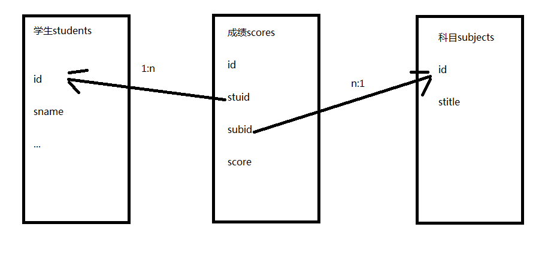

---
title:关系型数据库MySql高级查询
---

## 关系型数据库MySql高级查询

## 关系

- 创建成绩表scores，结构如下
  - id
  - 学生
  - 科目
  - 成绩
- ​
- 思考：学生列应该存什么信息呢？
- 答：学生列的数据不是在这里新建的，而应该从学生表引用过来，关系也是一条数据；根据范式要求应该存储学生的编号，而不是学生的姓名等其它信息
- 同理，科目表也是关系列，引用科目表中的数据



- 创建表的语句如下

```sql
create table scores(
id int primary key auto_increment,
stuid int,
subid int,
score decimal(5,2)
);
```

#### 外键

- 思考：怎么保证关系列数据的有效性呢？任何整数都可以吗？
- 答：必须是学生表中id列存在的数据，可以通过外键约束进行数据的有效性验证
- 为stuid添加外键约束

```sql
alter table scores add constraint stu_sco foreign key(stuid) references students(id);
```

- 此时插入或者修改数据时，如果stuid的值在students表中不存在则会报错
- 在创建表时可以直接创建约束

```sql
create table scores(
id int primary key auto_increment,
stuid int,
subid int,
score decimal(5,2),
foreign key(stuid) references students(id),
foreign key(subid) references subjects(id)
);
```

#### 外键的级联操作

- 在删除students表的数据时，如果这个id值在scores中已经存在，则会抛异常
- 推荐使用逻辑删除，还可以解决这个问题
- 可以创建表时指定级联操作，也可以在创建表后再修改外键的级联操作
- 语法

```sql
alter table scores add constraint stu_sco foreign key(stuid) references students(id) on delete cascade;
```

- 级联操作的类型包括：

  - restrict（限制）：默认值，抛异常
  - cascade（级联）：如果主表的记录删掉，则从表中相关联的记录都将被删除
  - set null：将外键设置为空
  - no action：什么都不做

  #### 连接查询

  - 连接查询分类如下：
    - 表A inner join 表B：表A与表B匹配的行会出现在结果中
    - 表A left join 表B：表A与表B匹配的行会出现在结果中，外加表A中独有的数据，未对应的数据使用null填充
    - 表A right join 表B：表A与表B匹配的行会出现在结果中，外加表B中独有的数据，未对应的数据使用null填充
  - 在查询或条件中推荐使用“表名.列名”的语法
  - 如果多个表中列名不重复可以省略“表名.”部分
  - 如果表的名称太长，可以在表名后面使用' as 简写名'或' 简写名'，为表起个临时的简写名称

  #### 练习

  - 查询学生的姓名、平均分

  ```sql
  select students.sname,avg(scores.score)
  from scores
  inner join students on scores.stuid=students.id
  group by students.sname;
  ```

  - 查询男生的姓名、总分

  ```sql
  select students.sname,avg(scores.score)
  from scores
  inner join students on scores.stuid=students.id
  where students.gender=1
  group by students.sname;
  ```

  - 查询科目的名称、平均分

  ```sql
  select subjects.stitle,avg(scores.score)
  from scores
  inner join subjects on scores.subid=subjects.id
  group by subjects.stitle;
  ```

  - 查询未删除科目的名称、最高分、平均分

  ```sql
  select subjects.stitle,avg(scores.score),max(scores.score)
  from scores
  inner join subjects on scores.subid=subjects.id
  where subjects.isdelete=0
  group by subjects.stitle;
  ```

#### 自关联

- 设计省信息的表结构provinces
  - id
  - ptitle
- 设计市信息的表结构citys
  - id
  - ctitle
  - proid
- citys表的proid表示城市所属的省，对应着provinces表的id值
- 问题：能不能将两个表合成一张表呢？
- 思考：观察两张表发现，citys表比provinces表多一个列proid，其它列的类型都是一样的
- 意义：存储的都是地区信息，而且每种信息的数据量有限，没必要增加一个新表，或者将来还要存储区、乡镇信息，都增加新表的开销太大
- 答案：定义表areas，结构如下
  - id
  - atitle
  - pid
- 因为省没有所属的省份，所以可以填写为null
- 城市所属的省份pid，填写省所对应的编号id
- 这就是自关联，表中的某一列，关联了这个表中的另外一列，但是它们的业务逻辑含义是不一样的，城市信息的pid引用的是省信息的id
- 在这个表中，结构不变，可以添加区县、乡镇街道、村社区等信息
- 创建areas表的语句如下：

```sql
create table areas(
id int primary key,
atitle varchar(20),
pid int,
foreign key(pid) references areas(id)
);
```

- 从sql文件中导入数据

```sql
source areas.sql;
```

- 查询一共有多少个省
- 查询省的名称为“山西省”的所有城市

```sql
select city.* from areas as city
inner join areas as province on city.pid=province.id
where province.atitle='山西省';
```

- 查询市的名称为“广州市”的所有区县

```sql
select dis.*,dis2.* from areas as dis
inner join areas as city on city.id=dis.pid
left join areas as dis2 on dis.id=dis2.pid
where city.atitle='广州市';
```

### 字符串函数

- 查看字符的ascii码值ascii(str)，str是空串时返回0

```sql
select ascii('a');
```

- 查看ascii码值对应的字符char(数字)

```sql
select char(97);
```

- 拼接字符串concat(str1,str2...)

```sql
select concat(12,34,'ab');
```

- 包含字符个数length(str)

```sql
select length('abc');
```

- 截取字符串
  - left(str,len)返回字符串str的左端len个字符
  - right(str,len)返回字符串str的右端len个字符
  - substring(str,pos,len)返回字符串str的位置pos起len个字符

```sql
select substring('abc123',2,3);
```

- 去除空格
  - ltrim(str)返回删除了左空格的字符串str
  - rtrim(str)返回删除了右空格的字符串str
  - trim([方向 remstr from str)返回从某侧删除remstr后的字符串str，方向词包括both、leading、trailing，表示两侧、左、右

```sql
select trim('  bar   ');
select trim(leading 'x' FROM 'xxxbarxxx');
select trim(both 'x' FROM 'xxxbarxxx');
select trim(trailing 'x' FROM 'xxxbarxxx');
```

- 返回由n个空格字符组成的一个字符串space(n)

```sql
select space(10);
```

- 替换字符串replace(str,from_str,to_str)

```sql
select replace('abc123','123','def');
```

- 大小写转换，函数如下
  - lower(str)
  - upper(str)

```sql
select lower('aBcD');
```

### 数学函数

- 求绝对值abs(n)

```sql
select abs(-32);
```

- 求m除以n的余数mod(m,n)，同运算符%

```sql
select mod(10,3);
select 10%3;
```

- 地板floor(n)，表示不大于n的最大整数

```sql
select floor(2.3);
```

- 天花板ceiling(n)，表示不小于n的最大整数

```sql
select ceiling(2.3);
```

- 求四舍五入值round(n,d)，n表示原数，d表示小数位置，默认为0

```sql
select round(1.6);
```

- 求x的y次幂pow(x,y)

```sql
select pow(2,3);
```

- 获取圆周率PI()

```sql
select PI();
```

- 随机数rand()，值为0-1.0的浮点数

```sql
select rand();
```

- 还有其它很多三角函数，使用时可以查询文档

### 日期时间函数

- 获取子值，语法如下
  - year(date)返回date的年份(范围在1000到9999)
  - month(date)返回date中的月份数值
  - day(date)返回date中的日期数值
  - hour(time)返回time的小时数(范围是0到23)
  - minute(time)返回time的分钟数(范围是0到59)
  - second(time)返回time的秒数(范围是0到59)

```sql
select year('2016-12-21');
```

- 日期计算，使用+-运算符，数字后面的关键字为year、month、day、hour、minute、second

```sql
select '2016-12-21'+interval 1 day;
```

- 日期格式化date_format(date,format)，format参数可用的值如下

  - 获取年%Y，返回4位的整数

    *　获取年%y，返回2位的整数

    *　获取月%m，值为1-12的整数

  - 获取日%d，返回整数

    *　获取时%H，值为0-23的整数

    *　获取时%h，值为1-12的整数

    *　获取分%i，值为0-59的整数

    *　获取秒%s，值为0-59的整数

```sql
select date_format('2016-12-21','%Y %m %d');
```

- 当前日期current_date()

```sql
select current_date();
```

- 当前时间current_time()

```sql
select current_time();
```

- 当前日期时间now()

```sql
select now();
```

### 视图

- 对于复杂的查询，在多次使用后，维护是一件非常麻烦的事情
- 解决：定义视图
- 视图本质就是对查询的一个封装
- 定义视图

```sql
create view stuscore as 
select students.*,scores.score from scores
inner join students on scores.stuid=students.id;
```

- 视图的用途就是查询

```sql
select * from stuscore;
```

### 事务

- 当一个业务逻辑需要多个sql完成时，如果其中某条sql语句出错，则希望整个操作都退回
- 使用事务可以完成退回的功能，保证业务逻辑的正确性
- 事务四大特性(简称ACID)
  - 原子性(Atomicity)：事务中的全部操作在数据库中是不可分割的，要么全部完成，要么均不执行
  - 一致性(Consistency)：几个并行执行的事务，其执行结果必须与按某一顺序串行执行的结果相一致
  - 隔离性(Isolation)：事务的执行不受其他事务的干扰，事务执行的中间结果对其他事务必须是透明的
  - 持久性(Durability)：对于任意已提交事务，系统必须保证该事务对数据库的改变不被丢失，即使数据库出现故障
- 要求：表的类型必须是innodb或bdb类型，才可以对此表使用事务
- 查看表的创建语句

```sql
show create table students;
```

- 修改表的类型

```sql
alter table '表名' engine=innodb;
```

- 事务语句

```sql
开启begin;
提交commit;
回滚rollback;
```

#### 示例1

- 步骤1：打开两个终端，连接mysql，使用同一个数据库，操作同一张表

```sql
终端1：
select * from students;
------------------------
终端2：
begin;
insert into students(sname) values('张飞');
```

- 步骤2

```sql
终端1：
select * from students;
```

- 步骤3

```sql
终端2：
commit;
------------------------
终端1：
select * from students;
```

#### 示例2

- 步骤1：打开两个终端，连接mysql，使用同一个数据库，操作同一张表

```sql
终端1：
select * from students;
------------------------
终端2：
begin;
insert into students(sname) values('张飞');
```

- 步骤2

```sql
终端1：
select * from students;
```

- 步骤3

```sql
终端2：
rollback;
------------------------
终端1：
select * from students;
```